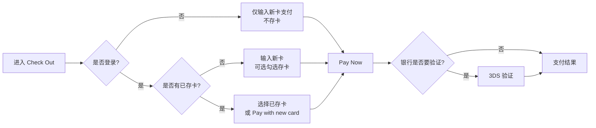
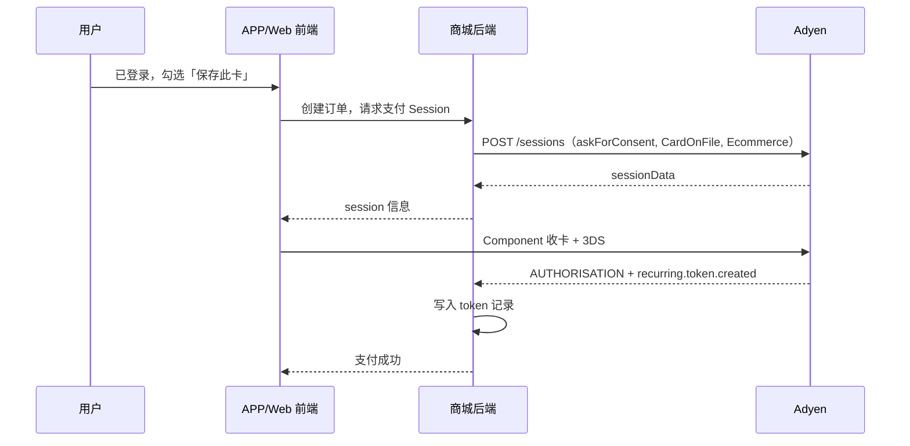
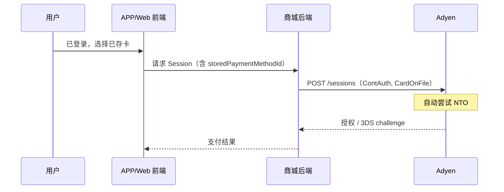
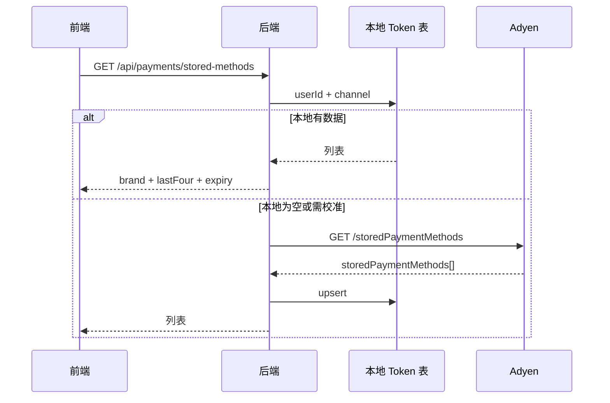
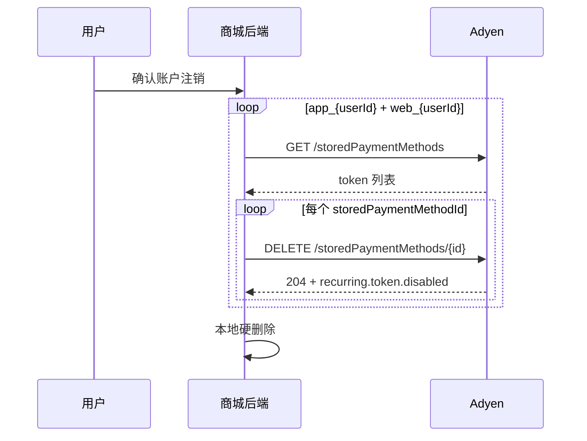

# Adyen 卡支付 · 历史卡保存与一键复购 PRD


| 属性          | 内容                                        |
| ----------- | ----------------------------------------- |
| **文档版本**    | v1.7                                      |
| **需求范围**    | 自研 APP 商城 · 信用卡/借记卡支付                     |
| **首期上线市场**  | US、EU、UK、CA                               |
| **支付合作方**   | Adyen                                     |
| **状态**      | 草稿 · 决策已锁定 · 待评审                          |
| **最后更新**    | 2026-07-20                                |
| **UI 交互原型** | `govee/adyen接入/Adyen-checkout-UI交互图.html` |
| **UI 交互规格** | `govee/adyen接入/Adyen-checkout-UI交互规格.md`  |


> **阅读说明：** 第 1～9 章面向**产品、运营、法务**；第 10 章及附录为**研发 / 支付对接**专用，含 API 与流程图。

---


# 第一部分 · 产品需求说明

---


## 1. 背景与目标


### 1.1 我们在解决什么问题？

老用户在 APP商城**复购**时，每次结账都要重新输入卡号、有效期、安全码，步骤多、容易中途放弃，也拉高支付失败率。

本次希望在用户**自己同意**的前提下，把信用卡信息交给 Adyen 安全保管；下次同一端（APP 或 Web）登录后，结算页直接看到「Visa ···· 4242」这类已保存的卡，点 **Pay Now** 就能快速完成支付——**不是自动扣款**，仍然是用户每次主动下单才扣款。

同时接入 Adyen 的 **NTO（Network Token Optimization）** 能力：用户在后台无感知，由 Adyen 自动优化扣款成功率（例如换卡、过期卡场景）。

### 1.2 业务目标


| #   | 目标       | 怎么衡量                                       |
| --- | -------- | ------------------------------------------ |
| 1   | 缩短复购结账时间 | 对比首购 vs 复购的 checkout 耗时                    |
| 2   | 提高卡支付成功率 | 支付授权成功率；换卡/过期导致的失败占比下降                     |
| 3   | 提升复购转化   | 复购用户选择「已保存卡」支付的比例                          |
| 4   | 合规上线     | US / EU / UK / CA 四地隐私与支付规范满足；用户可删卡、注销可清数据 |


---

## 2. 需求要点

- 登录用户在 APP 商城结算页，勾选同意后将卡存入 Adyen；复购时选已存卡一键支付（每次仍须主动 Pay Now，非自动扣款）。
- 存卡默认不勾选，仅随真实订单存卡；不支持无订单单独绑卡。
- APP 与 Web 各存各的，不共享已存卡；游客仅当次支付，无存卡/已存卡能力。
- 账户页可查看、设默认、删除已存卡；注销账号后 24h 内清理 Adyen 及系统内支付记录。
- 首期上线 US、EU、UK、CA；后台开通 Adyen NTO 优化扣款成功率。
- 不做：订阅自动扣款、Apple Pay / Google Pay 等钱包绑卡存卡。

---

## 3. 用户场景


### 3.1 谁会用？


| 维度       | 说明                                        |
| -------- | ----------------------------------------- |
| **典型用户** | 已在 APP 或 Web **登录**、用信用卡下过单、愿意勾选「保存此卡」的用户 |
| **地区**   | US、EU、UK、CA                               |
| **端**    | APP 与 Web **分开**：在 APP 存的卡，只在 APP 结算页出现   |


### 3.2 三条主路径（运营视角）

**路径 A · 首购并保存卡**

```
登录 → 进入 Check Out → 选 Credit Card → 输入卡信息
     → 勾选「Save this card…」（默认未勾选）
     → Pay Now →（如需）银行验证 → 支付成功 → 账户页可见该卡
```

**路径 B · 复购一键支付**

```
登录 → 进入 Check Out → 选 Credit Card → 看到已存卡列表（如 Visa ···· 4242）
     → 默认选中常用卡 → Pay Now →（如需）银行验证 → 支付成功
     （无需再输入完整卡号）
```

**路径 C · 换一张新卡支付**

```
登录 → Check Out → 已存卡下方点「Pay with a new card」
     → 输入新卡 → 可选勾选保存 → Pay Now
```


### 3.3 特殊场景说明


| 场景                | 用户看到什么                        | 运营需知         |
| ----------------- | ----------------------------- | ------------ |
| **未登录下单**         | 只有输入新卡；**没有**存卡勾选、**没有**已存卡列表 | 与现网类似，不存卡    |
| **登录但未勾选存卡**      | 支付成功，**不会**保存卡                | 正常情况         |
| **勾选存卡但保存失败**     | 订单仍成功；提示下次需重新输入卡              | 需客服知晓，可排查    |
| **APP 存卡、Web 购物** | Web 看不到 APP 存的卡               | 需 FAQ：两端分别保存 |
| **删卡**            | 账户 → 支付方式 → 删除；下次需重新输入        | 删后不可恢复       |
| **注销账户**          | 已存卡一并清除；通知里说明已删除支付方式          | 24h 内完成清理    |


### 3.4 用户动线总览




---


## 4. 功能规则


### 4.1 首购存卡


| 规则   | 说明                                                          |
| ---- | ----------------------------------------------------------- |
| 谁能存  | **已登录**用户                                                   |
| 怎么触发 | 结算页勾选「Save this card for faster checkout next time」+ 本单支付成功 |
| 勾选默认 | **默认不勾选**                                                   |
| 存卡时机 | **必须本单真实扣款成功**；不支持「只绑卡不购物」                                  |
| 存失败  | 订单照常成功；不显示为已保存；可提示「未能保存，下次需重新输入卡信息」                         |


### 4.2 复购一键支付


| 规则     | 说明                                            |
| ------ | --------------------------------------------- |
| 谁能用    | **已登录** + **当前端**有已存卡                         |
| 页面展示   | 卡品牌 + 末四位 + 过期时间，如 `Visa ···· 4242 Exp 03/28` |
| 能否展示这些 | **可以**——仅为用户本人看到的脱敏信息，不是完整卡号                  |
| 默认选中   | 默认卡；若无默认则上次使用的卡                               |
| 支付     | 选卡后直接 Pay Now；一般不用再输入完整卡号                     |
| 银行验证   | 部分订单仍可能弹出银行验证（3DS），属正常情况                      |
| 支付失败   | 提示失败原因；可换一张已存卡、用新卡或换 PayPal 等                 |


### 4.3 账户 · 支付方式管理


| 功能  | 说明                                 |
| --- | ---------------------------------- |
| 入口  | 账户 → Payment Methods（支付方式）         |
| 能看到 | 本端已存卡：品牌、末四位、过期时间                  |
| 能做  | 设默认、删除                             |
| 不能做 | **没有「添加新卡」**——新卡只能在 checkout 下单时保存 |


### 4.4 账户注销与数据删除


| 规则   | 说明                              |
| ---- | ------------------------------- |
| 触发   | 用户确认注销账户                        |
| 动作   | 清除 APP、Web 两端在 Adyen 及系统内的全部已存卡 |
| 时效   | **24 小时内**完成；超时告警               |
| 用户告知 | 注销成功通知中写明「已保存的支付方式已删除」          |


### 4.5 已存卡展示（复购列表）


| 规则    | 说明                                  |
| ----- | ----------------------------------- |
| 展示内容  | 卡组织（Visa/Mastercard 等）+ 末四位 + 过期月/年 |
| 不展示   | 完整卡号、CVV、持卡人姓名                      |
| 数据从哪来 | 首购存卡成功后由系统记录；换卡/改过期后自动更新展示          |
| 合规    | 仅登录用户看**自己的**卡；隐私政策中须说明             |


---


## 5. 页面与交互

> 可交互预览：`Adyen-checkout-UI交互图.html`（浏览器打开，切换 S0～S5）  
> 详细标注：`Adyen-checkout-UI交互规格.md`


### 5.1 改造范围（相对现网结算页截图）

**不变：** 订单金额区（原价、优惠券、运费、税）、PayPal/Klarna 等其它支付方式、底部 Total + Pay Now。

**仅改 Credit Card 展开区域：**


| 页面状态  | 什么时候出现                 | Credit Card 区域长什么样                             |
| ----- | ---------------------- | ---------------------------------------------- |
| 游客结账  | 未登录                    | 与现网一样：只有输入卡号/有效期/CVV                           |
| 首购存卡  | 已登录、还没有存过的卡            | 输入卡信息 + **存卡勾选（默认不勾）** + 隐私小字                  |
| 复购一键  | 已登录、有已存卡               | **已存卡列表**（单选）+「Pay with a new card」；默认不显示完整输入框 |
| 复购用新卡 | 点击 Pay with a new card | 已存卡列表 + 下方展开新卡输入 + 存卡勾选                        |


### 5.2 复购 · 已存卡列表示意

```
Select the payment method

  Credit Card                                    ✓
  ┌─────────────────────────────────────────────┐
  │ ●  [Visa]   Visa ···· 4242    Exp 03/28  Default │
  │ ○  [MC]     Mastercard ···· 8888  Exp 11/27      │
  │     Pay with a new card                          │
  └─────────────────────────────────────────────┘
```


### 5.3 首购 · 存卡勾选示意

在 Security code 输入框**下方**新增：

```
☐  Save this card for faster checkout next time
    Your full card number and CVV are not stored by us.
    Payment details are securely stored by Adyen.  Learn more
```

- 勾选框 **默认空白（不勾选）**
- Learn more → 跳转隐私政策「支付方式与支付信息」章节（需法务审定文案）


### 5.4 账户页 · 删卡确认

> After deleting, you'll need to enter your card details again at checkout.

---


## 6. 运营 · 合规与隐私（必读）

> 以下为业务侧检查清单，**不构成法律意见**。上线前须法务对 US/EU/UK/CA 书面确认。


### 6.1 运营需要配合的事


| #   | 事项            | 说明                                |
| --- | ------------- | --------------------------------- |
| 1   | 隐私政策更新        | 增加「支付方式与支付信息」章节（见 7.3）            |
| 2   | Checkout 英文文案 | 存卡勾选、Learn more、删卡提示——**法务审定后**上线 |
| 3   | 客服 FAQ        | APP/Web 不共享已存卡；删卡/注销后需重新输入；不是自动扣款 |
| 4   | 联系 Adyen      | 商务/支付同事开通「存卡 + NTO」能力             |
| 5   | 上线地区          | 确认四地 checkout 与隐私表述一致             |


### 6.2 必须让用户知道的事


| 要点       | 建议表述方向（英文，待法务定稿）              |
| -------- | ----------------------------- |
| 存卡是自愿的   | 默认不勾选；勾选后才保存                  |
| 我们不存完整卡号 | 完整卡号和 CVV 不由我们保存，由 Adyen 安全处理 |
| 不是自动扣款   | 每次扣款发生在你点击 Pay Now 确认订单之后     |
| 可以随时删    | 账户 → 支付方式 → 删除                |
| 注销会清数据   | 注销账户会删除已保存的支付方式               |


### 6.3 隐私政策建议新增章节要点


| 条目    | 内容                                |
| ----- | --------------------------------- |
| 收集什么  | 在你同意后：卡品牌、末四位、有效期等**非完整卡号**信息     |
| 不收集什么 | 完整银行卡号、CVV                        |
| 用途    | 快捷支付、订单处理、退款、反欺诈                  |
| 共享对象  | Adyen（支付处理）、发卡行（完成支付所必需）          |
| 保留多久  | 至你删除 / 账户注销                       |
| 你的权利  | 随时在 APP/Web 删除；依法享有访问、删除等权利（适用地区） |


### 6.4 四地关注要点（业务侧）


| 地区     | 运营/法务关注点             |
| ------ | -------------------- |
| **US** | 各州隐私法；存卡须用户主动勾选      |
| **EU** | GDPR 同意与删除权；银行验证较常见  |
| **UK** | 类似 EU；隐私政策须覆盖 UK     |
| **CA** | 加隐私同意要求；魁北克或需双语（待确认） |


---


## 7. 异常与客服场景


| 用户问题 / 现象              | 原因         | 建议处理                |
| ---------------------- | ---------- | ------------------- |
| 「为什么 Web 看不到 APP 存的卡？」 | 两端不共享      | FAQ：请在使用的端重新存卡      |
| 「我勾了存卡但没保存成功」          | 后台同步偶发失败   | 订单有效；下次重新输入并勾选；技术排查 |
| 「删卡后还能扣款吗？」            | 已删除 token  | 不能；需重新输入卡           |
| 「一键支付还要银行验证？」          | 发卡行风控      | 正常现象，完成验证即可         |
| 「注销后还有卡信息吗？」           | 24h 清理 SLA | 不应保留；超时可提工单         |


---


## 8. 验收标准（业务侧）


| 编号    | 场景         | 通过标准                        |
| ----- | ---------- | --------------------------- |
| BC-01 | 首购存卡       | 登录 + 勾选存卡 + 支付成功 → 账户页可见该卡  |
| BC-02 | 复购一键       | 登录 + 选已存卡 → 无需输入完整卡号 → 支付成功 |
| BC-03 | 默认不勾选      | 存卡勾选框初始为未勾选                 |
| BC-04 | 未勾选        | 支付成功但不保存卡                   |
| BC-05 | 未登录        | 无已存卡列表、无存卡勾选                |
| BC-06 | APP/Web 隔离 | 跨端看不到对方已存卡                  |
| BC-07 | 删卡         | 删除后 checkout 与账户页均不再出现      |
| BC-08 | 无单独绑卡      | 账户页无「添加卡」入口                 |
| BC-09 | 已存卡展示      | 仅品牌 + 末四位 + 过期，无完整卡号        |
| BC-10 | 合规文案       | 勾选旁说明 + 隐私政策章节已上线           |
| BC-11 | 账户注销       | 24h 内支付数据清除；用户收到说明          |


> 技术侧补充验收见 **附录 D**。

---


## 9. 排期与分工


### 9.1 分期


| 阶段     | 用户能感知到的能力             |
| ------ | --------------------- |
| **P0** | 存卡、复购一键、删卡、注销清数据      |
| **P1** | 支付成功率监控；换卡后过期时间自动更新展示 |
| **P2** | 默认卡体验优化；长期未使用卡过期策略    |


### 9.2 协作分工


| 角色    | 负责                  |
| ----- | ------------------- |
| 产品    | 规则、验收、原型            |
| 运营    | 隐私政策协同、FAQ、上线检查     |
| 法务    | 文案与四地合规确认           |
| 商务/支付 | 联系 Adyen 开通存卡 + NTO |
| 研发    | 前后端 + Adyen 对接（见附录） |
| 测试    | 业务场景 + 支付联调         |


---


# 第二部分 · 技术实现方案

> 以下供**研发、测试、支付对接**使用。产品/运营可跳过，验收时可对照附录 D。

---


## 10. 技术方案总览


### 10.1 集成方式


| 项       | 方案                                          |
| ------- | ------------------------------------------- |
| 集成流     | Adyen **Sessions flow** + Drop-in/Component |
| PCI     | 卡数据不进商户服务器，目标 **SAQ A**                     |
| NTO     | 联系 Adyen AM 开通；开通后支付请求自动优化，无需改 UI           |
| API Key | 仅服务端持有                                      |


### 10.2 Tokenization 与 NTO


| 概念              | 说明                                               |
| --------------- | ------------------------------------------------ |
| **Adyen Token** | 用户授权存卡后生成 `storedPaymentMethodId`，存于 Adyen Vault |
| **NTO**         | Adyen 后台将 token 替换为卡组织 Network Token，提高授权率       |
| 组合              | 首购建 Token → 复购传 Token ID → Adyen 自动 NTO          |


### 10.3 shopperReference


| 规则  | 说明                              |
| --- | ------------------------------- |
| 格式  | `app_{userId}` / `web_{userId}` |
| 禁止  | 邮箱、手机号、姓名等 PII                  |
| 用途  | 关联用户与 Adyen 已存卡；APP/Web 隔离      |


---


## 附录 A · 系统交互流程


### A.1 首购存卡




### A.2 复购一键支付




### A.3 已存卡列表读取




### A.4 账户注销删 Token




---


## 附录 B · 功能需求与技术参数映射


| 业务规则   | 技术 ID       | 关键 Adyen 参数                                                                                                        |
| ------ | ----------- | ------------------------------------------------------------------------------------------------------------------ |
| 首购存卡   | REQ-PAY-001 | `storePaymentMethodMode: askForConsent` · `recurringProcessingModel: CardOnFile` · `shopperInteraction: Ecommerce` |
| 复购一键   | REQ-PAY-002 | `shopperInteraction: ContAuth` · `paymentMethod.storedPaymentMethodId`                                             |
| 支付方式管理 | REQ-PAY-003 | DELETE `/storedPaymentMethods/{id}`                                                                                |
| 注销删数据  | REQ-PAY-004 | GET + DELETE 双渠道 shopperReference                                                                                  |
| 已存卡展示  | REQ-PAY-005 | `brand` · `lastFour` · `expiryMonth/Year`                                                                          |


### B.1 首购 Session 示例

```json
{
  "merchantAccount": "YOUR_MERCHANT_ACCOUNT",
  "amount": { "value": 9999, "currency": "USD" },
  "reference": "ORDER_20260720_001",
  "shopperReference": "app_12345678",
  "returnUrl": "yourapp://payment/return",
  "countryCode": "US",
  "storePaymentMethodMode": "askForConsent",
  "shopperInteraction": "Ecommerce",
  "recurringProcessingModel": "CardOnFile"
}
```


### B.2 复购 Session 示例

```json
{
  "merchantAccount": "YOUR_MERCHANT_ACCOUNT",
  "amount": { "value": 4999, "currency": "USD" },
  "reference": "ORDER_20260720_002",
  "shopperReference": "app_12345678",
  "shopperInteraction": "ContAuth",
  "recurringProcessingModel": "CardOnFile",
  "returnUrl": "yourapp://payment/return",
  "paymentMethod": {
    "type": "scheme",
    "storedPaymentMethodId": "M5N7TQ4TG5PFWR50"
  }
}
```

---


## 附录 C · Adyen 配置与接口


### C.1 Customer Area 配置


| 配置项          | 说明                                                 |
| ------------ | -------------------------------------------------- |
| Tokenization | 开通 Tokenize uplift                                 |
| NTO          | 联系 AM 开通                                           |
| API 角色       | Checkout webservice + Merchant Recurring           |
| Webhook      | Recurring tokens life cycle events + AUTHORISATION |


### C.2 Webhook 清单


| Webhook                           | 用途                       |
| --------------------------------- | ------------------------ |
| `recurring.token.created`         | 新卡写入本地                   |
| `recurring.token.updated`         | 过期时间等更新（Account Updater） |
| `recurring.token.disabled`        | 删卡 / 注销                  |
| `recurring.token.alreadyExisting` | 防重复                      |
| `AUTHORISATION`                   | 支付结果、NTO 监控字段            |


### C.3 商城后端 API


| 接口                                  | 方法     | 说明           | 鉴权   |
| ----------------------------------- | ------ | ------------ | ---- |
| `/api/payments/session`             | POST   | 创建支付 Session | 登录   |
| `/api/payments/stored-methods`      | GET    | 已存卡列表        | 登录   |
| `/api/payments/stored-methods/{id}` | DELETE | 删卡           | 登录   |
| `/api/account/closure`              | POST   | 注销（含清 token） | 登录   |
| `/api/webhooks/adyen`               | POST   | Adyen 回调     | HMAC |


### C.4 已存卡 API 响应示例

```json
{
  "storedMethods": [
    {
      "id": "M5N7TQ4TG5PFWR50",
      "brand": "visa",
      "brandDisplay": "Visa",
      "lastFour": "4242",
      "expiryMonth": "03",
      "expiryYear": "28",
      "isDefault": true
    }
  ]
}
```


### C.5 Adyen 删 Token

```http
GET  /storedPaymentMethods?merchantAccount=&shopperReference=
DELETE /storedPaymentMethods/{id}?merchantAccount=&shopperReference=
```

- 成功删除：**HTTP 204**
- 后续：`recurring.token.disabled` webhook


### C.6 注销清 Token 伪代码

```python
def delete_all_stored_cards_on_account_closure(user_id: str):
    for channel, shopper_ref, merchant_account in [
        ("app", f"app_{user_id}", APP_MERCHANT_ACCOUNT),
        ("web", f"web_{user_id}", WEB_MERCHANT_ACCOUNT),
    ]:
        for token in db.list_tokens(user_id, channel):
            adyen.delete_stored_payment_method(token.id, shopper_ref, merchant_account)
        for item in adyen.list_stored_payment_methods(shopper_ref, merchant_account):
            adyen.delete_stored_payment_method(item["id"], shopper_ref, merchant_account)
        db.hard_delete_tokens(user_id, channel)
```

---


## 附录 D · 数据规范与验收


### D.1 本地存储字段


| 字段                           | 存储   | Adyen 来源 | 说明                    |
| ---------------------------- | ---- | -------- | --------------------- |
| `storedPaymentMethodId`      | ✅    | `id`     | 支付时用                  |
| `brand` / `lastFour`         | ✅    | 同名字段     | UI 展示                 |
| `expiryMonth` / `expiryYear` | ✅    | 同名字段     | 可被 Account Updater 更新 |
| `is_default`                 | ✅    | —        | 业务字段                  |
| 完整 PAN / CVV                 | ❌    | —        | 禁止                    |
| `holderName`                 | ❌ 本期 | —        | 避免存 PII               |


### D.2 数据同步策略


| 时机          | 动作                                       |
| ----------- | ---------------------------------------- |
| 首购成功        | webhook `recurring.token.created` → 写本地  |
| 进入 checkout | 读本地；空则 Adyen GET 兜底                      |
| 换卡/改过期      | webhook `recurring.token.updated` → 更新本地 |
| 删卡/注销       | Adyen DELETE + 本地删 + `disabled` webhook  |


### D.3 技术验收（补充 BC 业务验收）


| 编号     | 场景      | 预期                             |
| ------ | ------- | ------------------------------ |
| TC-001 | Webhook | 存卡收到 `recurring.token.created` |
| TC-002 | 删卡      | Adyen 204 + disabled webhook   |
| TC-003 | 注销      | 24h 内双渠道 token 清空              |
| TC-004 | NTO     | 抽样 `networkTokenOffered=true`  |
| TC-005 | 3DS     | challenge 可完成并回跳               |
| TC-006 | 安全      | API Key 不在客户端；webhook 验签       |
| TC-007 | 同步      | `token.updated` 后 UI 过期时间更新    |


### D.4 非功能需求


| 项               | 要求                        |
| --------------- | ------------------------- |
| Session API P99 | < 500ms（不含 Adyen）         |
| 鉴权              | stored-methods 未登录返回 401  |
| 监控              | NTO 使用率、授权率 Dashboard（P1） |


### D.5 参考文档

- [Tokenization](https://docs.adyen.com/online-payments/tokenization)
- [Network Tokenization](https://docs.adyen.com/online-payments/network-tokenization)
- [Manage tokens](https://docs.adyen.com/online-payments/tokenization/managing-tokens)
- [GET /storedPaymentMethods](https://docs.adyen.com/api-explorer/Checkout/latest/get/storedPaymentMethods)

---


## 修订记录


| 版本        | 日期         | 变更说明                           |
| --------- | ---------- | ------------------------------ |
| v1.0～v1.4 | 2026-07-20 | 见历史版本                          |
| v1.5      | 2026-07-20 | **结构重组**：前半运营可读；技术/API/流程图归入附录 |
| v1.6      | 2026-07-20 | 合并精简 §2 范围与边界；§3 决策表压缩         |
| v1.7      | 2026-07-20 | 去掉范围/决策表，改为 §2 需求要点（6 条）；章节顺延 |


---

*文档路径：*`govee/adyen接入/Adyen-NTO卡支付一键复购-PRD.md`