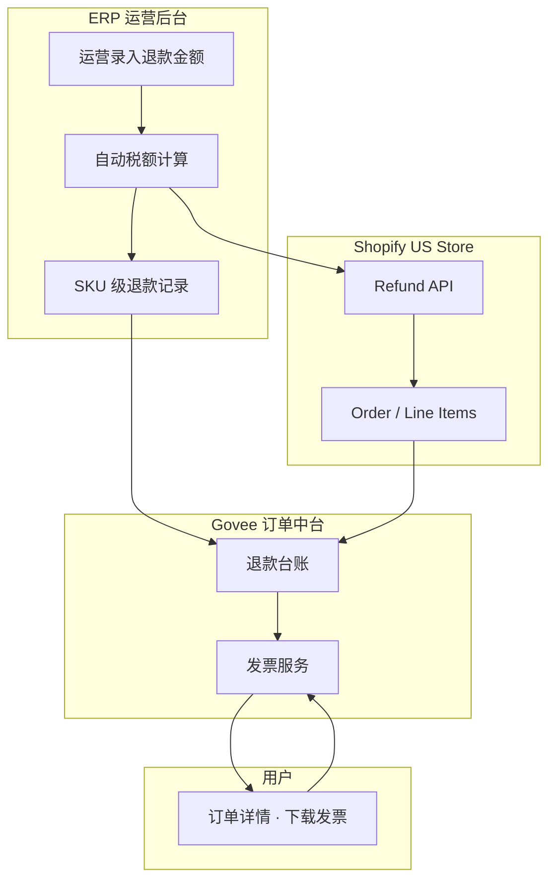
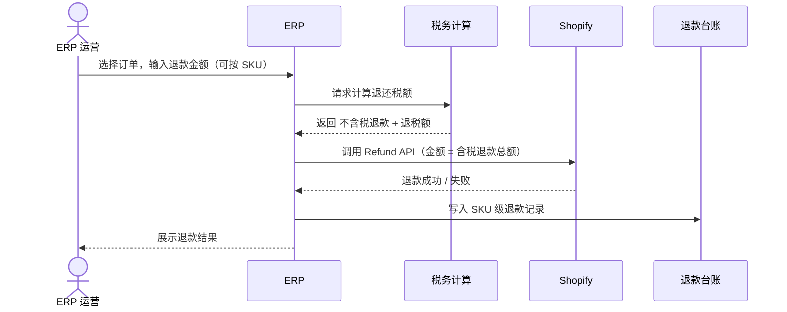
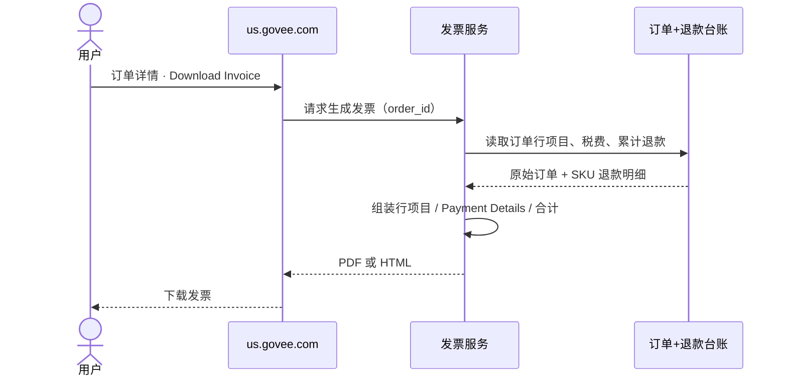

# us.govee.com 部分退款发票更新 PRD

| 属性 | 内容 |
|------|------|
| **文档版本** | v0.5 |
| **文件名** | us-govee-部分退款发票更新-PRD-v0.2.md |
| **站点范围** | 仅美国站（us.govee.com） |
| **定价模式** | 不含税定价（Tax-exclusive） |
| **状态** | 评审中 |
| **最后更新** | 2026-07-10 |

---

## 1. 背景与问题

### 1.1 业务背景

美国站订单在发生**部分退款**后，用户仍可能通过订单详情页手动触发发票下载。当前发票逻辑未区分「全额订单」与「部分退款订单」，导致：

- 发票金额与实付/实退不一致，引发客服咨询与合规风险；
- 退款信息未在发票上结构化展示，用户无法核对退款明细；
- ERP 与 Shopify 退款链路割裂，运营在 ERP 录入退款后，发票侧无法自动感知 SKU 级退款记录。

### 1.2 目标用户

| 角色 | 诉求 |
|------|------|
| **美国站消费者** | 下载与当前订单状态一致的发票，清晰看到退款金额与税费 |
| **ERP 运营** | 在 ERP 录入退款金额，系统自动算税并触发 Shopify 退款，留下 SKU 级记录 |
| **客服 / 财务** | 发票字段可追溯、可审计，减少手工解释成本 |

### 1.3 核心目标

1. **ERP 驱动退款**：运营在 ERP 输入退款金额 → 自动计算税额 → 触发 Shopify 退款 → 落库 SKU 级退款记录。
2. **发票手动触发、数据准确**：用户手动下载发票时，展示完整行项目 + 退款区块，合计公式符合美国不含税定价习惯。
3. **仅美国站**：其他区域站点不在本期范围。

---

## 2. 范围定义

### 2.1 In Scope

- us.govee.com 订单的部分退款场景（含多次部分退款累计）
- ERP → 税务计算 → Shopify Refund API → 内部退款台账（SKU 级）
- 发票 PDF/HTML 生成：行项目、Payment Details、税费与合计
- 发票下载入口：订单详情页手动触发（与现网一致）

### 2.2 Out of Scope

- 非美国站（eu.govee.com、uk.govee.com 等）
- 全额退款后订单关闭场景的发票策略变更（沿用现网）
- 含税定价（Tax-inclusive）站点
- 自动邮件推送退款发票（本期仍为用户主动下载）

---

## 3. 术语表

| 术语 | 说明 |
|------|------|
| **Tax-exclusive** | 商品标价不含税；税费在结账时按地址计算并叠加 |
| **部分退款** | 订单未全额退款，仍保留部分商品或金额 |
| **退款含税金额** | 退还给用户的金额 = 退款商品小计（不含税）+ 对应退还税额 |
| **SKU 级记录** | 每次退款在系统内按 SKU/行项目维度记录数量与金额 |
| **手动触发发票** | 用户在订单详情点击「Download Invoice」，非系统自动发送 |

---

## 4. 系统架构

### 4.1 架构总览



### 4.2 数据流原则

- **退款真相源**：ERP 发起 → Shopify 执行 → 中台台账同步；发票只读台账与订单快照。
- **发票生成时机**：用户点击下载时实时组装（或读取已生成缓存），必须反映截至下载时刻的累计退款。
- **税费**：退款税额由 ERP 算税服务按原订单税率/规则计算，不重新按当前地址计税。

---

## 5. 业务流程

### 5.1 ERP 部分退款流程



### 5.2 用户下载发票流程



---

## 6. 功能需求 — ERP 退款

### REQ-ERP-001 退款金额录入

| 字段 | 要求 |
|------|------|
| **描述** | ERP 运营可选择美国站订单，按订单行（SKU）或指定金额发起部分退款 |
| **输入** | 退款数量/金额（不含税基准或系统约定口径）、退款原因（可选） |
| **校验** | 累计退款不得超过订单可退上限；币种与订单一致（USD） |
| **优先级** | P0 |

### REQ-ERP-002 自动税额计算

| 字段 | 要求 |
|------|------|
| **描述** | 录入退款金额后，系统按原订单计税规则自动计算应退税额 |
| **输出** | `refund_subtotal_ex_tax`、`refund_tax`、`refund_total_incl_tax` |
| **规则** | 与下单时税率一致；多税率行项目按行分别计算后汇总 |
| **优先级** | P0 |

### REQ-ERP-003 触发 Shopify 退款并落库

| 字段 | 要求 |
|------|------|
| **描述** | 算税完成后调用 Shopify Refund API，成功后写入 SKU 级退款记录 |
| **SKU 记录** | 订单号、SKU、行 ID、退款数量、不含税金额、税额、含税总额、退款时间、Shopify refund_id |
| **失败处理** | Shopify 失败则不写台账或标记失败，支持重试；不得出现台账已记但 Shopify 未退 |
| **优先级** | P0 |

---

## 7. 功能需求 — 发票展示

### 7.1 发票结构说明

发票在**部分退款**后仍展示**完整原始行项目**（不因退款隐藏商品行），并在独立区域展示退款与支付明细。

**合计公式（美国站 · 不含税定价）：**

```
Total = Subtotal + Total tax + Shipping − Refunded
```

其中：

- **Subtotal**：原始订单商品小计（不含税），不随部分退款减少。
- **Total tax**：原始订单税额合计，**保持为下单时税额**，不随部分退款减少。
- **Shipping**：原始运费（不含税；若有运费税另按现网规则）。
- **Refunded**：累计已退金额（**含税**，即退给用户的钱）。

### 7.2 发票区块示意

```
┌─────────────────────────────────────────┐
│ Line Items（完整原始行项目）              │
│  SKU A   qty 2   $100.00                │
│  SKU B   qty 1   $50.00                 │
├─────────────────────────────────────────┤
│ Subtotal                    $150.00     │
│ Total tax                    $12.00     │
│ Shipping                     $5.00     │
│ Refunded (incl. tax)        −$55.00     │  ← 累计退款（含税）
├─────────────────────────────────────────┤
│ Total                      $112.00     │  ← 150+12+5−55
├─────────────────────────────────────────┤
│ Payment Details                         │
│   Paid (original)            $167.00     │
│   Refunded                  −$55.00     │
│   Net paid                  $112.00     │
└─────────────────────────────────────────┘
```

### REQ-INV-001 手动触发

| 字段 | 要求 |
|------|------|
| **描述** | 发票仅通过订单详情「Download Invoice」手动触发，不自动推送 |
| **权限** | 仅订单所属用户或客服授权场景可下载 |
| **优先级** | P0 |

### REQ-INV-002 完整行项目

| 字段 | 要求 |
|------|------|
| **描述** | 展示订单全部原始行项目：SKU 名称、数量、单价（不含税）、行小计 |
| **规则** | 部分退款后仍展示全部行，不在行内删减数量 |
| **优先级** | P0 |

### REQ-INV-003 Refunded（incl. tax）汇总行

| 字段 | 要求 |
|------|------|
| **描述** | 在合计区展示 `Refunded (incl. tax)`，金额为累计退款含税总额 |
| **展示** | 负数或带 − 前缀；多次部分退款合并为一行累计值 |
| **优先级** | P0 |

### REQ-INV-004 Total tax 保持原订单税额

| 字段 | 要求 |
|------|------|
| **描述** | `Total tax` 始终等于原始订单税额，不扣减退款对应税额 |
| **原因** | 与不含税 Subtotal 配合，通过 Refunded 行体现资金变动，避免用户误解商品计税基础变化 |
| **优先级** | P0 |

### REQ-INV-005 合计公式

| 字段 | 要求 |
|------|------|
| **描述** | `Total = Subtotal + Total tax + Shipping − Refunded` |
| **精度** | 金额保留两位小数，四舍五入；币种 USD |
| **优先级** | P0 |

### REQ-INV-006 Payment Details · Refunded 行

| 字段 | 要求 |
|------|------|
| **描述** | Payment Details 区块包含：`Paid (original)`、`Refunded`、`Net paid` |
| **Refunded** | 与合计区 Refunded (incl. tax) 金额一致 |
| **Net paid** | 原始实付 − 累计退款 |
| **优先级** | P0 |

### REQ-INV-007 多次部分退款

| 字段 | 要求 |
|------|------|
| **描述** | 同一订单多次部分退款时，发票展示累计退款，无需逐笔列出（明细以 ERP/客服为准） |
| **数据** | 发票服务读取台账 SUM(refund_total_incl_tax) |
| **优先级** | P1 |

### REQ-INV-008 无退款订单

| 字段 | 要求 |
|------|------|
| **描述** | 未发生退款的订单，发票不展示 Refunded 行，Total 公式退化为 Subtotal + Total tax + Shipping |
| **兼容性** | 与现网美国站发票版式兼容 |
| **优先级** | P0 |

---

## 8. 数据模型（摘要）

### 8.1 退款台账 `order_refund_line`

| 字段 | 类型 | 说明 |
|------|------|------|
| id | bigint | 主键 |
| order_id | string | 订单号 |
| shopify_refund_id | string | Shopify 退款 ID |
| line_item_id | string | 行项目 ID |
| sku | string | SKU |
| quantity | int | 退款数量 |
| amount_ex_tax | decimal | 不含税退款额 |
| tax_amount | decimal | 退税额 |
| amount_incl_tax | decimal | 含税退款额 |
| created_at | datetime | 创建时间 |

### 8.2 发票快照（可选缓存）

生成发票时可缓存：`order_id`、`generated_at`、`refunded_total`、`pdf_url`，便于审计；非必须落库。

---

## 9. 非功能需求

| 编号 | 类别 | 要求 |
|------|------|------|
| NFR-001 | 性能 | 发票生成 P95 < 3s |
| NFR-002 | 一致性 | 发票 Refunded 金额与 Shopify 退款总额一致（允许 ±$0.01 舍入） |
| NFR-003 | 审计 | ERP 退款操作留痕：操作人、时间、前后金额 |
| NFR-004 | 安全 | 发票下载需登录且校验订单归属 |
| NFR-005 | 兼容 | 不影响未退款订单发票；美国站以外不加载新模板 |

---

## 10. 验收标准

| 编号 | 场景 | 预期结果 |
|------|------|----------|
| AC-001 | ERP 录入部分退款 $50+税 | Shopify 退款成功，台账有 SKU 记录 |
| AC-002 | 用户下载部分退款订单发票 | 行项目完整，有 Refunded (incl. tax) |
| AC-003 | 检查 Total tax | 等于原订单税额，未减少 |
| AC-004 | 检查 Total | 等于 Subtotal + Total tax + Shipping − Refunded |
| AC-005 | Payment Details | 含 Refunded 行，Net paid 正确 |
| AC-006 | 两次部分退款后下载 | Refunded 为两次含税之和 |
| AC-007 | 无退款订单 | 无 Refunded 行，版式与现网一致 |

---

## 11. 风险与依赖

| 风险 / 依赖 | 说明 | 缓解 |
|-------------|------|------|
| Shopify API 限流 | 大促批量退款 | 队列重试 + 监控 |
| 税率历史 | 下单后税率规则变更 | 以订单快照税率为准 |
| 舍入误差 | 行级退税汇总与 Shopify 差 1 分 | 最后一行吸收误差 |
| ERP 联调 | 依赖 ERP 排期 | 先 Mock 台账联调发票 |

---

## 12. 里程碑（建议）

| 阶段 | 内容 | 产出 |
|------|------|------|
| M1 | ERP 算税 + Shopify 退款 + 台账 | REQ-ERP-001~003 |
| M2 | 发票模板与合计逻辑 | REQ-INV-001~008 |
| M3 | 联调 + UAT | 验收用例通过 |
| M4 | 美国站灰度 → 全量 | 监控与客服话术 |

---

## 13. 开放问题

| # | 问题 | 负责人 | 状态 |
|---|------|--------|------|
| Q1 | 运费部分退款是否在 ERP 单独录入？ | 运营 | 待定 |
| Q2 | 发票是否展示每次退款日期明细？ | 产品 | 本期否，仅累计 |
| Q3 | B2B 免税订单退税是否为 0？ | 税务 | 确认中 |

---

## 14. 修订记录

| 版本 | 日期 | 作者 | 变更说明 |
|------|------|------|----------|
| v0.1 | 2026-07-08 | 产品 | 初稿：部分退款发票问题梳理 |
| v0.2 | 2026-07-09 | 产品 | 明确不含税定价与合计公式 |
| v0.3 | 2026-07-09 | 产品 | 增加 Payment Details 结构 |
| v0.4 | 2026-07-10 | 产品 | ERP 驱动退款流程与 SKU 台账 |
| v0.5 | 2026-07-10 | 产品 | 定稿 REQ-ERP/INV 编号、架构与时序图、验收标准 |

---

## 附录 A：计算示例

**原始订单**

- SKU A ×2：$100.00（不含税）
- SKU B ×1：$50.00（不含税）
- Subtotal：$150.00
- Total tax（8%）：$12.00
- Shipping：$5.00
- **原始实付**：$167.00

**部分退款**（退 SKU A 1 件 + 对应税）

- 不含税退款：$50.00
- 退税：$4.00
- **Refunded (incl. tax)**：$54.00

**发票合计**

- Total = 150 + 12 + 5 − 54 = **$113.00**
- Payment Details：Paid $167.00，Refunded −$54.00，Net paid $113.00

---

## 附录 B：相关链接

- 美国站订单详情（发票入口）
- Shopify Refund API 文档
- ERP 退款操作手册（待补充）
